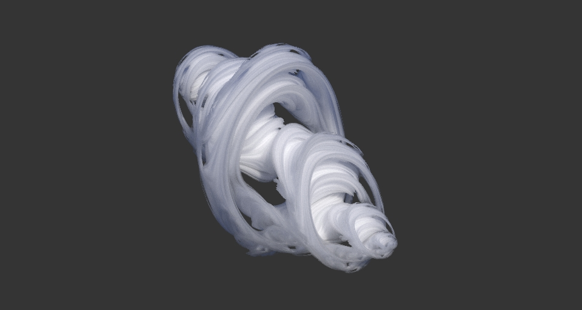

# CUDA-volpath

Volumetric cloud data in OpenVDB format from [WDAS](https://www.disneyanimation.com/data-sets/). Requires building the OpenVDB library and its dependencies. The render converges in several minutes.

If built without OpenVDB support, a procedural Julia Set is used.

