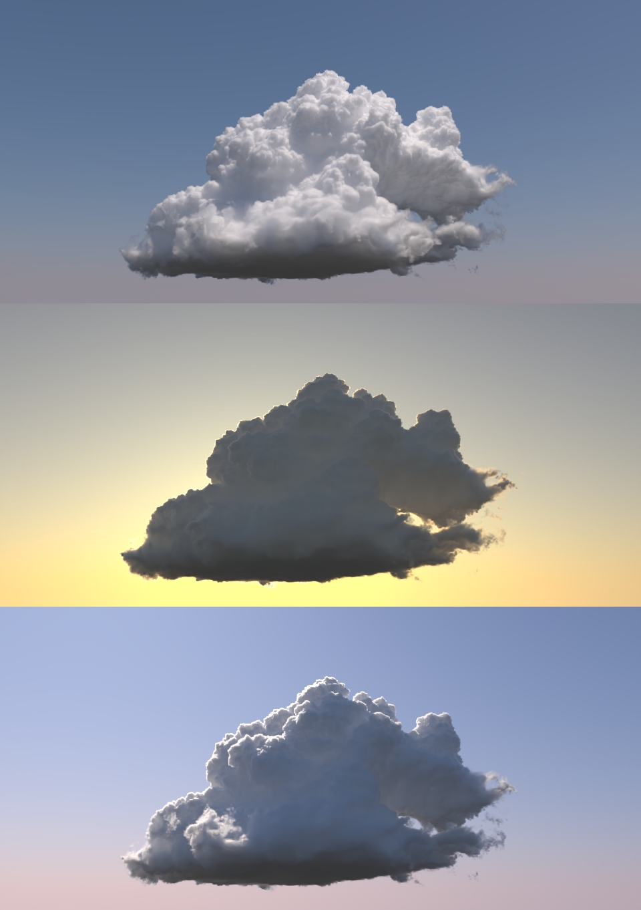

# CUDA-volpath

CUDA based volumetric path tracing for rendering heterogeneous and chromatic volumes. Using multiple techniques to accelerate the process, including reduced scattering coefficients[1][2] and spectral and decomposition tracking[3] with local density bounds.

The vdbloader utility requires installing the OpenVDB library and its dependencies, and can be used to read the volumetric cloud data from [WDAS](https://www.disneyanimation.com/data-sets/).

Convergence takes roughly 30 seconds on GTX 1080 with 1k samples per pixel.

If built without OpenVDB support, a procedural Julia Set is used.

References
----------

[1] Jensen et al., A Practical Model for Subsurface Light Transport

[2] Burley et al., The Design and Evolution of Disney's Hyperion Renderer

[3] Kutz et al., Spectral and Decomposition Tracking for Rendering Heterogeneous Volumes